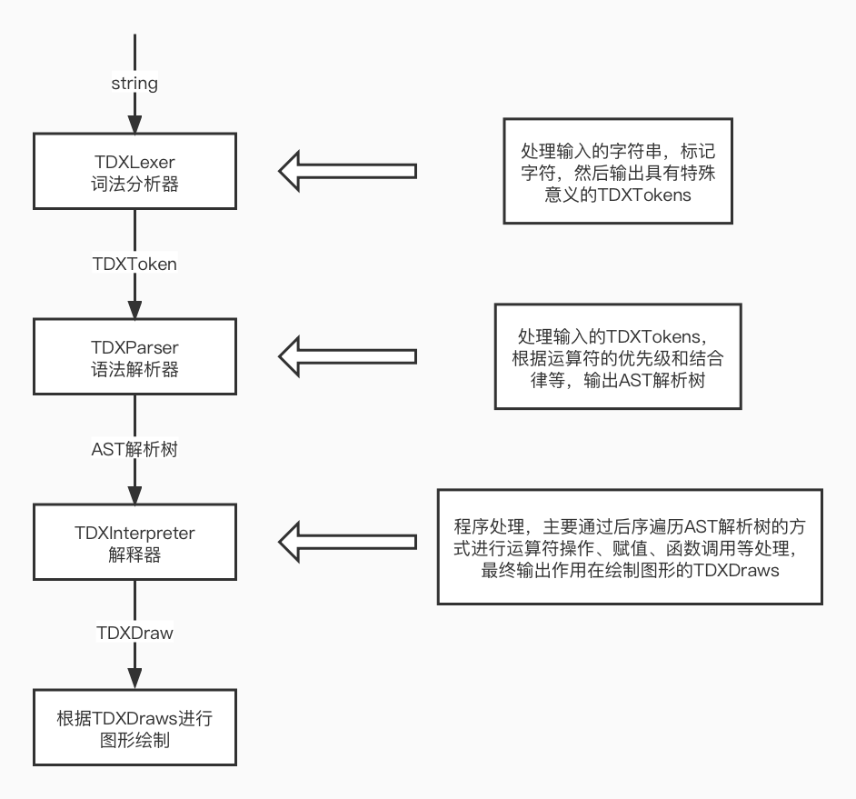
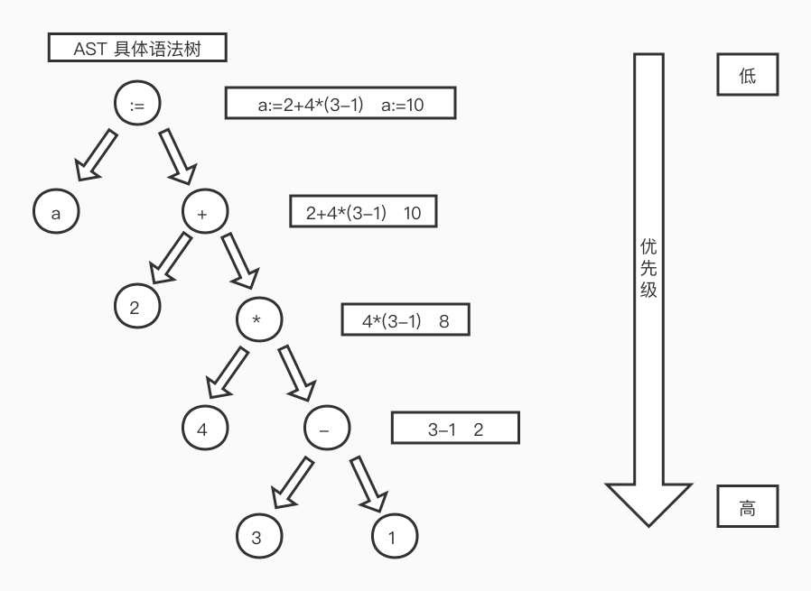
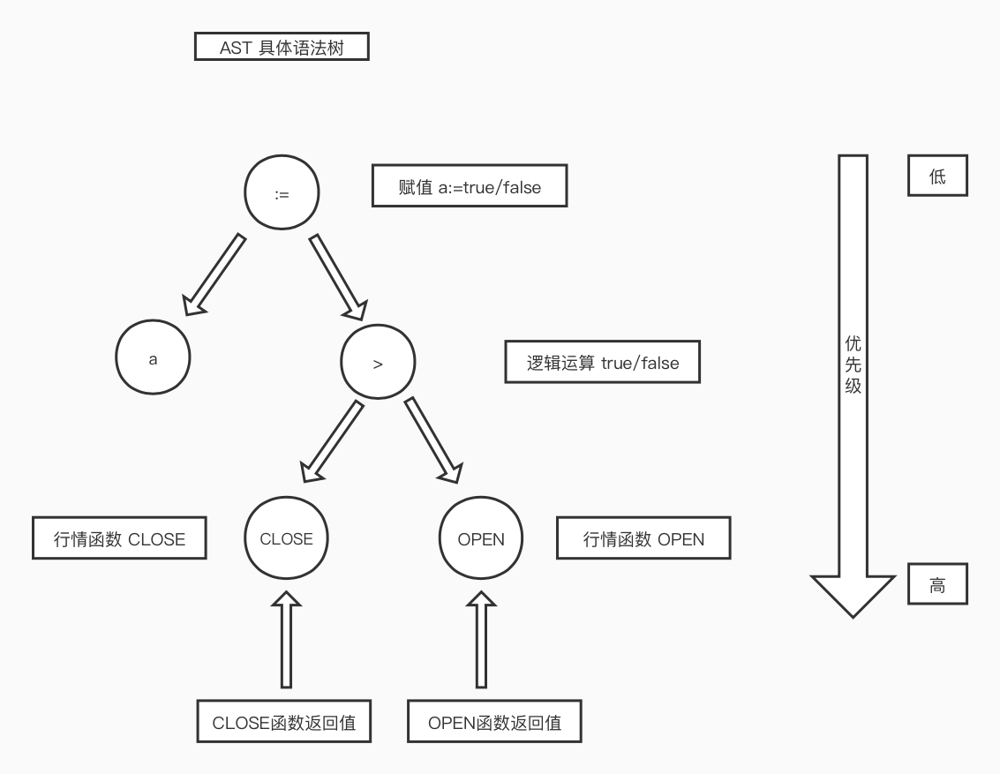
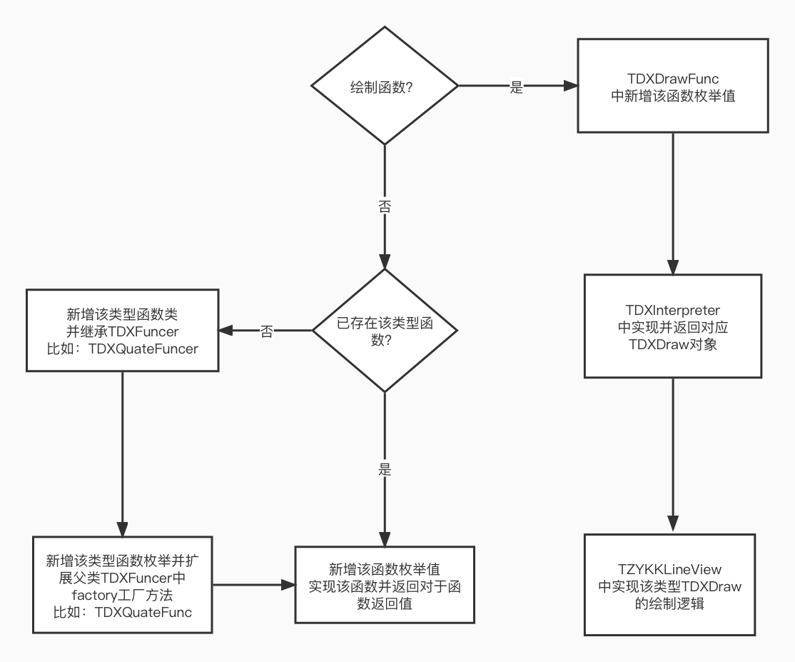

# TDXIndicatorModule

## 重点类

- TDXToken
  标识符类，主要是存储表达式中的信息
- TDXLexer
  词法分析器，主要是将字符串解析成一个个的标识符对象（TDXToken）
- TDXParser
  语法解析器，主要是将 TDXLexer 中解析出的 TDXToken 根据 运算符的优先级和结合律等 生成 AST 解析树
- TDXInterpreter
  解释器，主要是访问并解释 TDXParser 中解析出的 AST 语法树
- TDXFuncer
  函数处理器，主要是根据函数名称处理函数相关逻辑
- TDXFuncEnum
  函数枚举
- TDXDraw
  绘制函数类，记录绘制相关信息
  
## 辅助类

- TDXJob
  任务类，用于优化某些函数的数据处理
- TDXSemanticAnalyzer
  语义分析器，用于调试分析
- TDXSymbol
  符号类
- TDXActivationRecord
  活动记录类
- TDXCallStack
  调用栈

## 处理流程



## Example1

```swift
let str = "a:=2+4*(3-1);"
debugPrint("*************开始词法分析和语法分析生成AST语法树*************")
let lexer = TDXLexer(text: str)
let parser = TDXParser(lexer: lexer)
let tree = parser.parse()
debugPrint("*************开始解释代码*************")
let interpreter = TDXInterpreter(tree: tree, data: [])
interpreter.interpret()
```

- TDXLexer 中的 nextToken 方法会将 str 字符串解析成一个个 TDXTokenType 中支持类型 的 TDXToken 对象
  - 比如：a, :=, 2, +, 4, *, (, 3, -, 1, ), ; 等；
- TDXParser 中的 parse 方法会将入参 lexer 中的解析出的 TDXToken 对象解析成 AST 具体语法树
- TDXInterpreter 中的 interpret 方法会通过后序遍历的方式遍历并计算或处理 入参的 AST 具体语法树
  - 比如：

## Example2

```swift
let str = "a:=CLOSE>OPEN;"
debugPrint("*************开始词法分析和语法分析生成AST语法树*************")
let lexer = TDXLexer(text: str)
let parser = TDXParser(lexer: lexer)
let tree = parser.parse()
debugPrint("*************开始解释代码*************")
let interpreter = TDXInterpreter(tree: tree, data: [])
interpreter.interpret()
```

- 词法解析TDXLexer生成token
  Token: a -> id 类型
  Token: := -> assign 类型
  Token: CLOSE -> id 类型
  Token: > -> greater 类型
  Token: OPEN -> id 类型
  Token: ; -> semi 类型
- 语法分析TDXParser生成语法树及解释器TDXInterpreter访问并计算或者处理树
  - 比如：

## 开发

### 函数编写



### 语法扩展

- 更新词法分析器（TDXLexer）
  - 扩展Token类型（可选）
  - 更新nextToken方法处理逻辑
- 更新语法解析器（TDXParser）
  - 新增节点类型（可选）
  - 更新节点处理逻辑
- 更新解释器（TDXInterpreter）
  - 扩展基类TDXNodeVisitor节点访问方法（可选）
  - 重新基类新增节点访问方法（可选）
  - 更新节点访问方法处理逻辑
